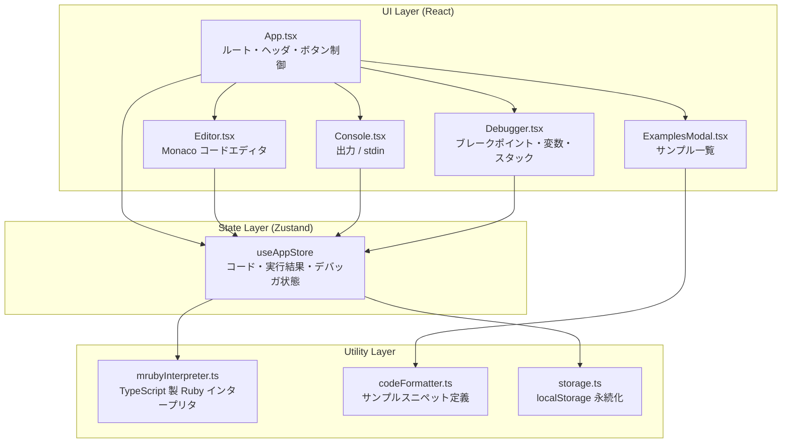
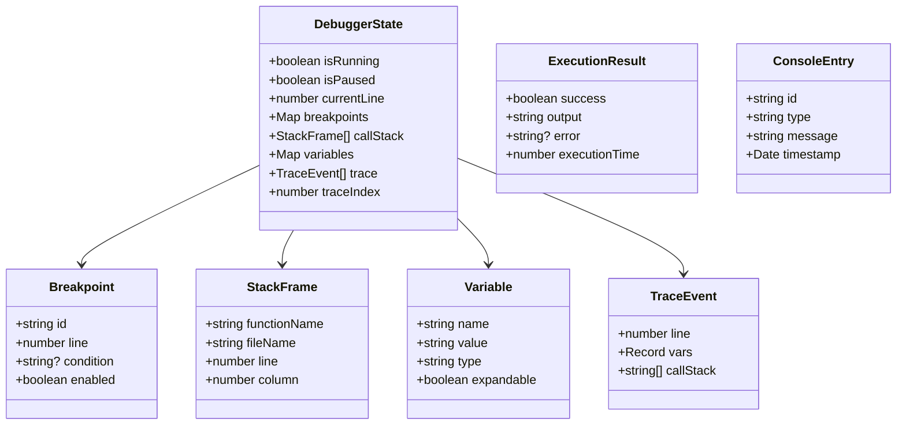
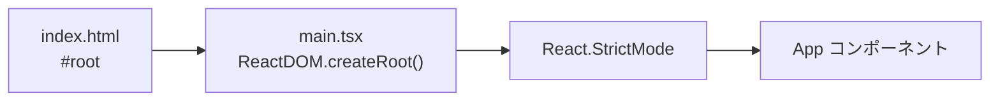
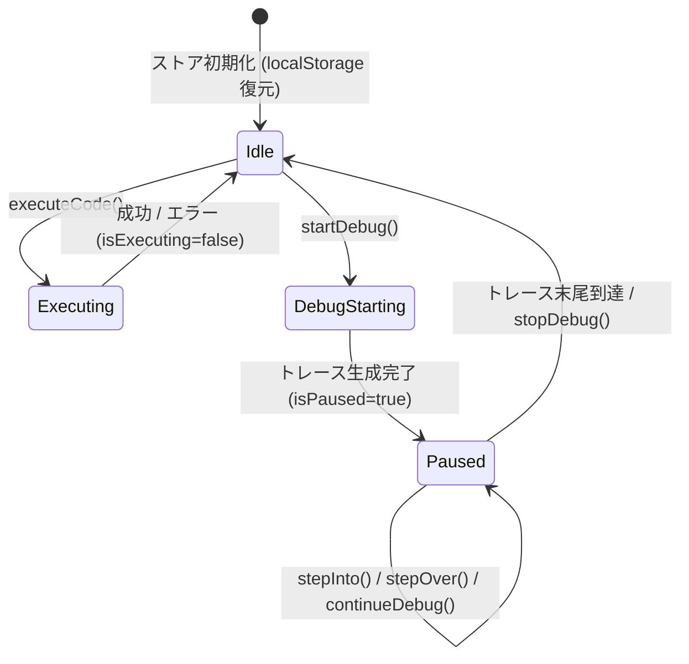
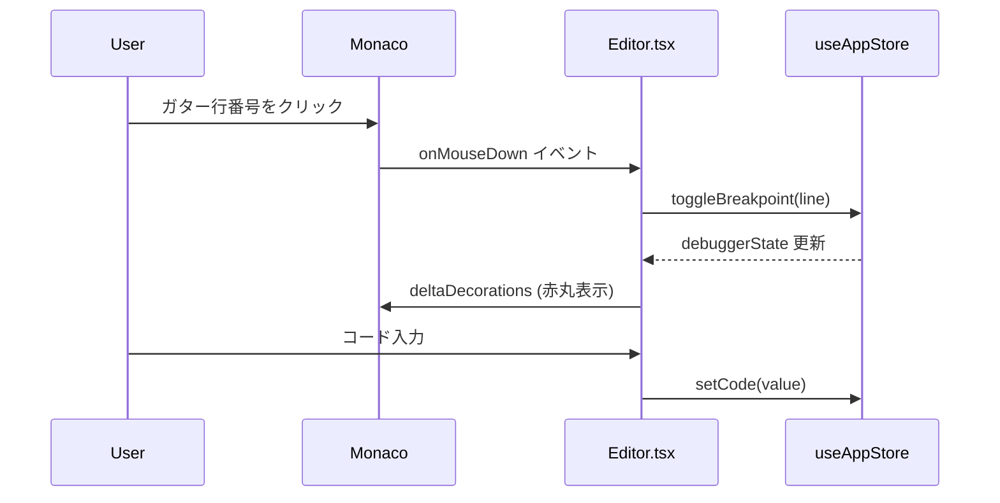
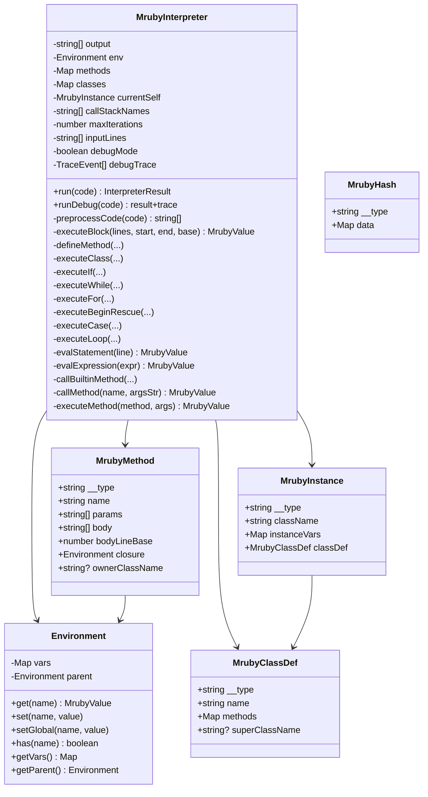
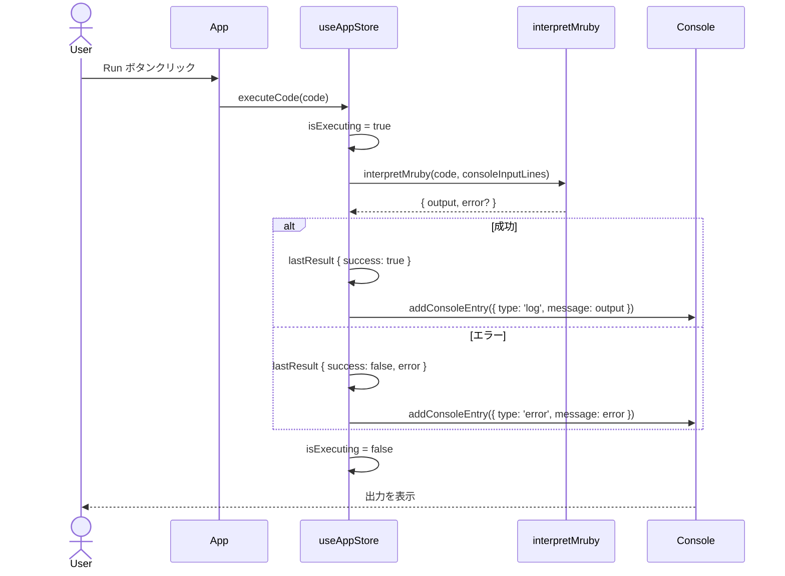
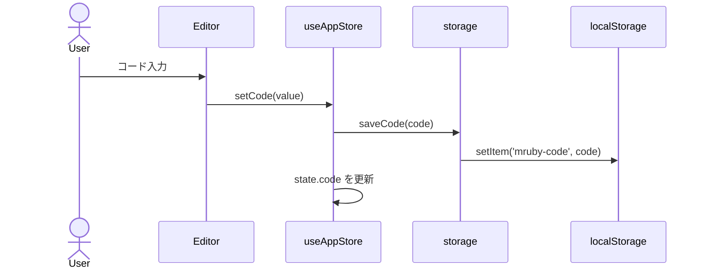
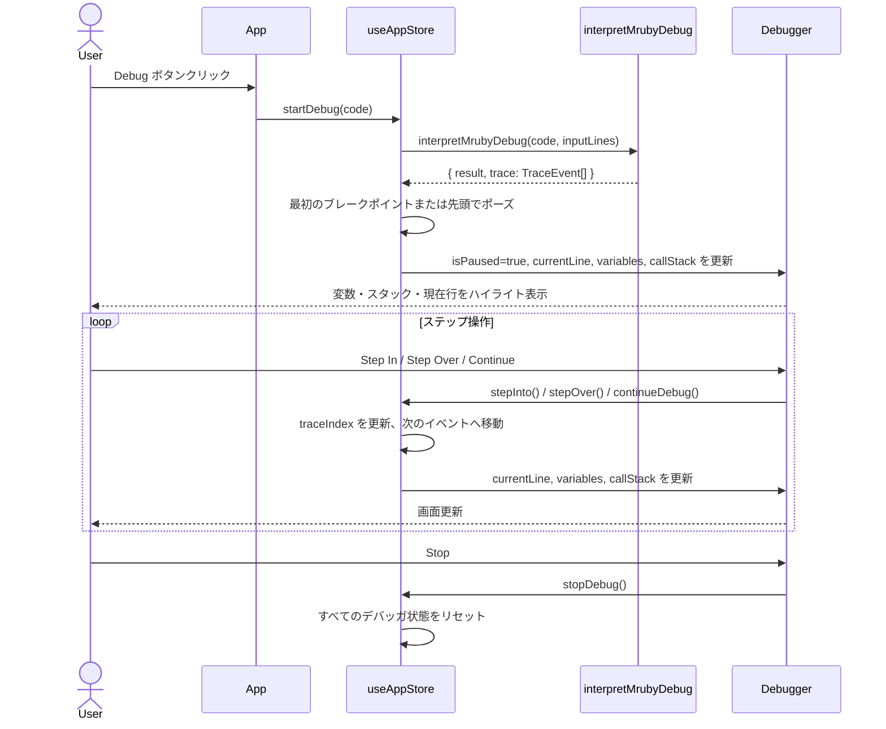
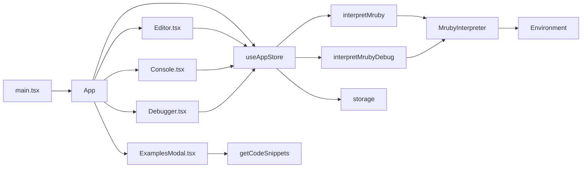

# mruby WASM Editor — アーキテクチャドキュメント

> ⚠️ **非公式プロジェクト / Unofficial Project**
> このドキュメントおよびプロジェクトは非公式のものであり、mruby 公式プロジェクト・開発チームとは一切関係ありません。
> This project is unofficial and is **not affiliated with, endorsed by, or associated with** the official mruby project.
> 公式 mruby リポジトリ / Official mruby repository: <https://github.com/mruby/mruby>

## 目次

1. [プロジェクト概要](#プロジェクト概要)
2. [ディレクトリ構成](#ディレクトリ構成)
3. [全体アーキテクチャ](#全体アーキテクチャ)
4. [型定義 (`src/types/index.ts`)](#型定義)
5. [エントリポイント (`src/main.tsx`)](#エントリポイント)
6. [アプリケーションルート (`src/App.tsx`)](#アプリケーションルート-apptsxtsx)
7. [状態管理 (`src/store/useAppStore.ts`)](#状態管理-storeuseappstorets)
8. [コンポーネント](#コンポーネント)
   - [Editor (`src/components/Editor.tsx`)](#editor-componentseditorstsx)
   - [Console (`src/components/Console.tsx`)](#console-componentsconsolestsx)
   - [Debugger (`src/components/Debugger.tsx`)](#debugger-componentsdebuggertsx)
   - [ExamplesModal (`src/components/ExamplesModal.tsx`)](#examplesmodal-componentsexamplesmodaltsx)
9. [カスタムフック (`src/hooks/useMruby.ts`)](#カスタムフック-hooksusemrubyts)
10. [ユーティリティ](#ユーティリティ)
    - [mrubyInterpreter (`src/utils/mrubyInterpreter.ts`)](#mrubyinterpreter-utilsmrubyinterpretersts)
    - [codeFormatter (`src/utils/codeFormatter.ts`)](#codeformatter-utilscodeformatterts)
    - [storage (`src/utils/storage.ts`)](#storage-utilsstoragets)
11. [データフロー図](#データフロー図)
12. [デバッガ動作シーケンス](#デバッガ動作シーケンス)
13. [クラス図](#クラス図)

---

## プロジェクト概要

**mruby WASM Editor** は、ブラウザ上で mruby (Ruby サブセット) コードをリアルタイムに実行・デバッグできる Web アプリケーションです。  
TypeScript 製の独自インタープリタを内蔵しており、WASM なしでも Ruby の主要機能を実行できます。

| 技術スタック | 用途 |
|---|---|
| React 18 | UI レンダリング |
| TypeScript | 型安全な実装 |
| Zustand | グローバル状態管理 |
| Monaco Editor | コードエディタ |
| Vite | ビルドツール |
| Tailwind CSS | スタイリング |

---

## ディレクトリ構成

```
src/
├── App.tsx                  # アプリルートコンポーネント
├── main.tsx                 # React エントリポイント
├── index.css                # グローバルスタイル
├── types/
│   └── index.ts             # 型定義
├── store/
│   └── useAppStore.ts       # Zustand グローバルストア
├── hooks/
│   └── useMruby.ts          # mruby 実行フック
├── components/
│   ├── Editor.tsx           # Monaco コードエディタ
│   ├── Console.tsx          # 出力コンソール・標準入力
│   ├── Debugger.tsx         # デバッガパネル
│   └── ExamplesModal.tsx    # サンプルコードモーダル
└── utils/
    ├── mrubyInterpreter.ts  # mruby インタープリタ本体
    ├── codeFormatter.ts     # コードスニペット定義
    └── storage.ts           # localStorage ラッパー
```

---

## 全体アーキテクチャ



---

## 型定義

**ファイル:** `src/types/index.ts`

アプリケーション全体で使用される TypeScript インターフェースを定義します。

| 型名 | 説明 |
|---|---|
| `Breakpoint` | ブレークポイント情報 (行番号・条件・有効フラグ) |
| `StackFrame` | コールスタックのフレーム (関数名・ファイル・行・列) |
| `Variable` | デバッガで表示する変数 (名前・値・型・展開可否) |
| `TraceEvent` | デバッグトレースの1ステップ (行番号・変数スナップショット・コールスタック) |
| `DebuggerState` | デバッガ全体の状態 (実行中・一時停止・ブレークポイント・トレース) |
| `ExecutionResult` | コード実行結果 (成功フラグ・出力・エラー・実行時間) |
| `ConsoleEntry` | コンソール出力エントリ (種別・メッセージ・タイムスタンプ) |
| `EditorState` | エディタ設定 (コード・言語・テーマ・フォントサイズ) |



---

## エントリポイント

**ファイル:** `src/main.tsx`



### `main.tsx`

| 処理 | 説明 |
|---|---|
| `ReactDOM.createRoot()` | `#root` 要素に React ルートを生成 |
| `render(<App />)` | `React.StrictMode` でラップして `App` をレンダリング |

---

## アプリケーションルート `App.tsx`

ヘッダーのボタン群と全コンポーネントのレイアウトを管理するルートコンポーネントです。

### ローカル状態

| 状態 | 型 | 説明 |
|---|---|---|
| `showDebugger` | `boolean` | デバッガパネルの表示・非表示 (モバイル) |
| `showExamples` | `boolean` | サンプルモーダルの表示・非表示 |
| `shareToast` | `string \| null` | シェア成功トーストのメッセージ |
| `fileInputRef` | `Ref` | 非表示ファイル入力への参照 |

### 関数一覧

#### `useEffect` — URLハッシュからコードを復元

```
初期化時に window.location.hash を読む
  → Base64 デコード → decodeURIComponent → setCode()
  → 履歴からハッシュを除去
```

#### `handleRun()`

```
executeCode(code) を呼び出してコードを実行する
依存: code, executeCode
```

#### `handleDebug()`

```
debuggerState.isRunning が true  → stopDebug()
debuggerState.isRunning が false → startDebug(code), setShowDebugger(true)
```

#### `handleClear()`

```
clearOutput()    // 実行結果をリセット
clearConsole()   // コンソール出力をクリア
```

#### `handleShare()`

```
code → encodeURIComponent → btoa → URL ハッシュ化
navigator.clipboard.writeText(url)
  成功 → "URLをコピーしました！" トースト (2.5秒)
  失敗 → URL 自体をトーストに表示 (4秒)
```

#### `handleDownload()`

```
code → Blob (text/plain) → オブジェクトURL
<a> タグを生成して click() → code.rb としてダウンロード
URL.revokeObjectURL() でクリーンアップ
```

#### `handleUpload()`

```
fileInputRef.current.click() で非表示 <input type="file"> を開く
```

#### `handleFileChange(e)`

```
e.target.files[0] を取得
FileReader.readAsText() で読み込み
onload コールバック → setCode(text)
input をリセット (同一ファイル再選択対応)
```

---

## 状態管理 `store/useAppStore.ts`

Zustand ストアでアプリ全体の状態と操作を一元管理します。



### ストアのプロパティ

| プロパティ | 型 | 説明 |
|---|---|---|
| `code` | `string` | 現在のエディタコード |
| `language` | `'ruby'` | 言語 (固定) |
| `theme` | `'vs-dark' \| 'vs-light'` | エディタテーマ |
| `fontSize` | `number` | フォントサイズ |
| `lastResult` | `ExecutionResult \| null` | 直前の実行結果 |
| `isExecuting` | `boolean` | 実行中フラグ |
| `consoleEntries` | `ConsoleEntry[]` | コンソール出力履歴 |
| `consoleInputLines` | `string[]` | stdin キューイング済み行 |
| `debuggerState` | `DebuggerState` | デバッガ全状態 |

### 関数一覧

#### `setCode(code)`

```
localStorage に保存 (storage.saveCode)
Zustand state に code をセット
```

#### `setTheme(theme)` / `setFontSize(size)`

```
Zustand state に値を直接セット
```

#### `executeCode(code)` — async

```
isExecuting = true
interpretMruby(code, consoleInputLines) を呼び出す
  成功 → lastResult { success: true, output, executionTime }
         addConsoleEntry({ type: 'log', message: output })
  エラー → lastResult { success: false, error }
           addConsoleEntry({ type: 'error', message: error })
  例外 → 上記エラーと同様
finally → isExecuting = false
```

#### `addConsoleEntry(entry)`

```
entry に { id: 'console-N', timestamp: new Date() } を付与して
consoleEntries 配列に追加
```

#### `clearConsole()`

```
consoleEntries = []
```

#### `addConsoleInputLine(line)` / `clearConsoleInputLines()`

```
consoleInputLines 配列への行追加 / 全消去
```

#### `toggleBreakpoint(line)`

```
breakpoints Map に line が存在する → 削除
存在しない → { id: 'bp-N', line, enabled: true } を追加
```

#### `startDebug(code)` — async

```
状態を初期化: isRunning=true, isPaused=false, trace=[], ...
interpretMrubyDebug(code, consoleInputLines) でトレース収集
breakpoints から最初に一致するトレースインデックスを検索
トレースが空の場合 → isRunning=false で終了
トレースがある場合:
  buildVariableMap(firstEvent) で変数 Map を構築
  isPaused=true, currentLine=firstEvent.line にセット
出力・エラーをコンソールに追加
```

#### `stopDebug()`

```
debuggerState をすべてリセット:
  isRunning=false, isPaused=false, currentLine=-1
  trace=[], traceIndex=-1, variables=new Map(), callStack=[]
```

#### `stepInto()`

```
traceIndex + 1 が trace.length 以上 → 終了状態へ
そうでなければ:
  nextIdx = traceIndex + 1
  buildVariableMap(trace[nextIdx]) で変数更新
  currentLine, callStack を更新
  stepMode = 'into'
```

#### `stepOver()`

```
現在のコールスタック深度を記録
深度が深くなっているトレースをスキップして
同じ深度または浅い次のトレースへジャンプ
変数・行番号・コールスタックを更新
stepMode = 'over'
```

#### `continueDebug()`

```
有効なブレークポイント行の Set を作成
traceIndex + 1 から次のブレークポイント行を探索
見つからない → 終了状態へ
見つかった → そのインデックスへジャンプ・変数更新
```

#### `updateDebugVariable(name, value)`

```
variables Map の既存エントリの value フィールドを更新
(デバッガパネルから変数値を手動変更する用途)
```

### ヘルパー関数

#### `buildVariableMap(event: TraceEvent): Map<string, Variable>`

```
TraceEvent.vars (Record<string, string>) を走査して
Variable オブジェクト { name, value, type, expandable: false } の Map を返す
```

---

## コンポーネント

### Editor `components/Editor.tsx`

Monaco Editor をラップし、ブレークポイントとデバッグ行のデコレーションを管理します。

#### `handleEditorChange(value)`

```
Monaco エディタの変更イベント
value !== undefined → setCode(value) でストアを更新
```

#### `handleEditorMount(editor, monacoInstance)` — OnMount コールバック

```
editorRef.current にエディタインスタンスを保存
glyphMargin: true でガター余白を有効化
onMouseDown ハンドラを登録:
  クリック対象が GUTTER_LINE_NUMBERS または GUTTER_GLYPH_MARGIN の場合
  → toggleBreakpoint(lineNumber)
```

#### `useEffect` — デコレーション更新

```
依存: [debuggerState.breakpoints, debuggerState.currentLine]
各 Breakpoint (enabled=true) に対して赤丸グリフデコレーションを生成
currentLine > 0 の場合は黄色ハイライト行デコレーションを追加
editor.deltaDecorations() で一括更新
currentLine が変わったら editor.revealLineInCenterIfOutsideViewport() でスクロール
```



---

### Console `components/Console.tsx`

実行出力の表示と stdin のキューイング入力を担当します。

#### `useEffect` — 自動スクロール

```
依存: [consoleEntries, lastResult]
endRef.current.scrollIntoView({ behavior: 'smooth' }) で最下部へスクロール
```

#### `getIcon(type)`

```
'error' → <AlertCircle> (赤)
'warn'  → <AlertTriangle> (黄)
'info'  → <Info> (青)
その他  → null
```

#### `handleClear()`

```
clearConsole()        // コンソール出力をクリア
clearConsoleInputLines()  // stdin キューをクリア
```

#### `handleInputKeyDown(e)`

```
キーが Enter の場合:
  addConsoleInputLine(inputValue)  // キューに行を追加
  setInputValue('')                // 入力欄をリセット
```

---

### Debugger `components/Debugger.tsx`

ブレークポイント一覧・変数ビューア・コールスタックを表示し、ステップ操作を提供します。

#### `startEdit(name, currentValue)`

```
editingVar = name で編集モードに入る
editValue = currentValue で初期値セット
```

#### `commitEdit(name)`

```
updateDebugVariable(name, editValue) でストアに反映
editingVar = null で編集モードを終了
```

#### `cancelEdit()`

```
editingVar = null で編集モードをキャンセル
```

#### レンダリングロジック

```
canStep = isPaused && trace.length > 0 && traceIndex < trace.length - 1

ツールバー:
  Step In ボタン  → canStep=true で stepInto() を呼ぶ
  Step Over ボタン → canStep=true で stepOver() を呼ぶ
  Continue ボタン → isPaused=true で continueDebug() を呼ぶ
  Stop ボタン     → isRunning=true のとき表示、stopDebug() を呼ぶ

BREAKPOINTS セクション:
  breakpoints Map を列挙、× ボタンで toggleBreakpoint(line)

VARIABLES セクション:
  variables Map を列挙
  ダブルクリック or ✎ ボタン → startEdit()
  編集中は <input> を表示、Enter で commitEdit()、Escape で cancelEdit()

CALL STACK セクション:
  callStack 配列を列挙、関数名・ファイル・行番号を表示
```

---

### ExamplesModal `components/ExamplesModal.tsx`

サンプルコードをカテゴリ別に表示し、エディタに読み込むモーダルです。

#### `ExamplesModal({ onClose, onLoad })`

```
初期化:
  snippets = getCodeSnippets()
  categories = snippets の category をユニーク化
  selectedCategory = categories[0]

カテゴリサイドバー:
  ボタンクリック → setSelectedCategory(cat)

スニペット一覧:
  selectedCategory でフィルタして表示
  ホバー時 → setHovered(snippet.name) でコードプレビュー表示
  クリック → handleLoad(snippet)

handleLoad(snippet):
  onLoad(snippet.code)  // エディタにコードをセット
  onClose()             // モーダルを閉じる
```

---

## カスタムフック `hooks/useMruby.ts`

`MrubyRuntime` インターフェースを返すフックです。現在は直接 `interpretMruby` を呼び出す同期実装を Promise でラップしています。

### `useMruby(): MrubyRuntime`

```
runtimeRef に MrubyRuntime オブジェクトを初期化:
  isReady: true
  execute(code):
    interpretMruby(code) を呼び出し
    result.error があれば throw new Error
    なければ result.output を返す
  eval(expression):
    interpretMruby(expression) を呼び出し
    result.output を返す
useEffect は現在何もしない (即時 Ready)
runtimeRef.current を返す
```

---

## ユーティリティ

### mrubyInterpreter `utils/mrubyInterpreter.ts`

TypeScript で実装された mruby (Ruby サブセット) インタープリタ本体です。

#### アーキテクチャ概要



#### エクスポート関数

##### `interpretMruby(code, inputLines?): InterpreterResult`

```
MrubyInterpreter を生成して run(code) を呼び出す
inputLines: stdin キュー (省略時は空配列)
戻り値: { output: string, error?: string }
```

##### `interpretMrubyDebug(code, inputLines?): { result, trace }`

```
MrubyInterpreter を生成して runDebug(code) を呼び出す
debugMode=true でトレースを収集して返す
戻り値: { result: InterpreterResult, trace: TraceEvent[] }
```

#### `class Environment`

スコープチェーンを表すクラスです。変数の参照は親スコープを辿ります。

| メソッド | 説明 |
|---|---|
| `get(name)` | 現スコープから親へ再帰的に変数を検索して返す |
| `set(name, value)` | 現スコープに変数をセット |
| `setGlobal(name, value)` | 最上位スコープに変数をセット (グローバル変数用) |
| `has(name)` | スコープチェーンに変数が存在するか確認 |
| `getVars()` | 現スコープの変数 Map を返す |
| `getParent()` | 親スコープを返す |

#### `class MrubyInterpreter` — メソッド一覧

##### `run(code): InterpreterResult`

```
preprocessCode(code) でコメント除去・行分割
executeBlock() で全行を実行
RubyException / Error をキャッチして error フィールドに格納
{ output: output.join(''), error? } を返す
```

##### `runDebug(code): { result, trace }`

```
debugMode = true
debugTrace = []
run(code) を呼び出し (内部でトレースが蓄積される)
{ result, trace: debugTrace } を返す
```

##### `recordTrace(lineNum)` — private

```
debugMode=false の場合は即返る
env のスコープチェーンを走査して全変数をスナップショット
currentSelf がある場合はインスタンス変数 (@xxx) も収集
{ line, vars, callStack } を debugTrace に push
```

##### `preprocessCode(code): string[]`

```
code を '\n' で split
各行に removeComment() を適用
コメント除去済み行の配列を返す
```

##### `removeComment(line): string`

```
文字列リテラル内かどうかを追跡しながら文字を走査
' または " でリテラル開始・終了を管理
文字列外で # を検出したらその位置で切り捨て
コメント除去済みの行を返す
```

##### `executeBlock(lines, start, end, lineNumBase): MrubyValue`

```
lines[start..end) を逐次実行するメインループ
各行でパターンマッチを行い対応するハンドラへ分岐:

  def → defineMethod()
  class → executeClass()
  if/unless → executeIf()
  while → executeWhile()
  for...in → executeFor()
  begin → executeBeginRescue()
  case → executeCase()
  loop → executeLoop()
  raise → RubyException をスロー
  break / next → 専用例外をスロー
  return → ReturnException をスロー
  puts / print / p → 出力系メソッドを実行
  その他 → evalStatement() で評価

debugMode=true の場合は各行の前に recordTrace() を呼ぶ
```

##### `checkIterations()`

```
iterationCount をインクリメント
maxIterations (10000) 超過で "Infinite loop detected" エラーをスロー
```

##### `defineMethod(lines, start, origIdx): number`

```
'def メソッド名(パラメータ)' を解析
対応する 'end' を探索 (ネスト対応)
MrubyMethod オブジェクトを生成:
  { name, params, body: lines[start+1..end), bodyLineBase, closure: env }
methods Map に登録
end の次の行インデックスを返す
```

##### `executeClass(lines, start, origIdx): number`

```
'class クラス名 < 親クラス名' を解析
MrubyClassDef を生成 (既存クラスは継承してメソッドをマージ)
クラスボディを走査:
  def → defineClassMethod() でクラスのメソッドMapに登録
  attr_accessor/attr_reader/attr_writer → generateAttrMethods()
end の次のインデックスを返す
```

##### `defineClassMethod(lines, start, origIdx, classDef): number`

```
クラス内の def ブロックを解析
MrubyMethod を生成して classDef.methods Map に登録
end の次のインデックスを返す
```

##### `lookupInstanceMethod(instance, methodName): MrubyMethod | null`

```
instance.classDef.methods からメソッドを検索
見つからなければ superClassName をたどって再帰的に検索
最終的に見つからなければ null を返す
```

##### `executeInstanceMethod(instance, method, args): MrubyValue`

```
クロージャを親とする新スコープを生成
パラメータを引数にバインド
currentSelf を instance に切り替え
callStackNames に 'クラス名#メソッド名' を push
executeBlock() でボディを実行
ReturnException をキャッチして戻り値を返す
実行後に currentSelf・callStackNames を復元
```

##### `executeIf(lines, start, end, startOrig): number`

```
条件式 (if/unless) を evalExpression() で評価
elsif / else を含む全ブランチを走査して対応ブロックを見つける
条件が真のブランチを executeBlock() で実行
end の次のインデックスを返す
```

##### `executeWhile(lines, start, end, startOrig): number`

```
条件式を解析
ループ本体の end を特定
while 条件が真の間:
  checkIterations()
  executeBlock() でボディを実行
  BreakException で break
  NextException で next (continue)
end の次のインデックスを返す
```

##### `executeFor(lines, start, end, startOrig): number`

```
'for 変数 in コレクション' を解析
コレクションを evalExpression() で評価
配列・範囲オブジェクトを反復:
  各要素を変数にセット
  executeBlock() でボディを実行
  BreakException / NextException に対応
end の次のインデックスを返す
```

##### `executeBeginRescue(lines, start, end, startOrig): number`

```
begin...rescue...ensure...end ブロックを解析
begin ブロックを executeBlock() で実行
RubyException 発生時 → rescue ブロックを executeBlock() で実行
ensure ブロックがあれば必ず executeBlock() で実行
end の次のインデックスを返す
```

##### `executeCase(lines, start, end, startOrig): number`

```
'case 式' を評価
when 節を順に解析して値/範囲と一致するブランチを検索
一致したブランチを executeBlock() で実行
一致なければ else ブランチを実行
end の次のインデックスを返す
```

##### `executeLoop(lines, start, end, startOrig): number`

```
loop do...end ブロックを実行
checkIterations() で無限ループを防止
BreakException で脱出
end の次のインデックスを返す
```

##### `generateAttrMethods(line, classDef)`

```
attr_accessor / attr_reader / attr_writer の属性名リストを解析
accessor → getter + setter メソッドを生成
reader   → getter のみ生成
writer   → setter のみ生成
生成したメソッドを classDef.methods に登録
```

##### `callSuper(expr): MrubyValue`

```
currentMethodStack から現在のクラス名・メソッド名を取得
superClassName を探索して親クラスの同名メソッドを呼び出す
```

##### `callMathMethod(method, args): MrubyValue`

```
Math モジュールのメソッドを JavaScript Math に委譲:
sqrt, sin, cos, tan, log, log2, log10, exp, abs, floor, ceil, round, PI, E
```

##### `executePuts(line)` / `executePrint(line)` / `executeP(line)`

```
引数文字列を parseArgs() で分割
各引数を evalExpression() で評価
puts: 各値を stringify して改行付きで output に追加 (引数なしは空行)
print: 改行なしで追加
p: inspect() 形式 (デバッグ表記) で追加
```

##### `parseArgs(line, funcName): string[]`

```
'funcName arg1, arg2' または 'funcName(arg1, arg2)' を解析
splitArgs() で引数を分割して返す
```

##### `splitArgs(str): string[]`

```
括弧・文字列・ハッシュ・配列のネストを追跡しながら
カンマで引数を分割
各引数の前後の空白をトリム
```

##### `evalStatement(line): MrubyValue`

```
代入文かどうかを判定して分岐:
  複合代入 (+=, -=, *=, /=, %=, **=, <<= など) → 演算後に代入
  a, b = b, a 形式の多重代入
  単純代入 → evalExpression() で評価して assignVar() でセット
代入でなければ evalExpression() を呼び出す
```

##### `assignVar(name, value)`

```
@変数 → currentSelf.instanceVars にセット
$変数 → setGlobal() でグローバルスコープにセット
その他 → env.set() で現スコープにセット
```

##### `evalExpression(expr): MrubyValue` — コアメソッド

```
式の評価を行うメインメソッド。優先度順に以下を試みる:

1. リテラル: nil, true, false, 整数, 浮動小数点, 文字列 (', ")
2. 配列リテラル [...]
3. ハッシュリテラル {...}
4. 範囲リテラル (a..b, a...b)
5. 論理演算子: &&, ||, and, or, not, !
6. 比較演算子: ==, !=, <=, >=, <, >, <=>
7. 算術演算子: +, -, *, /, %, **
8. ビット演算子: &, |, ^, <<, >>
9. 三項演算子: cond ? then : else
10. 文字列補間: "#{expr}"
11. ドット呼び出し: obj.method(args) → callBuiltinMethod()
12. ブロック付き呼び出し: method { |x| ... } → tryBlockCall()
13. メソッド呼び出し: name(args) → callMethod()
14. 変数参照: @変数, $変数, ローカル変数
```

##### `callBuiltinMethod(obj, method, argsStr, objExpr): MrubyValue`

```
obj の型に応じたビルトインメソッドを実行する大型ディスパッチャ:

クラスオブジェクト (MrubyClassDef):
  .new(args) → initialize を呼び出してインスタンスを生成

インスタンス (MrubyInstance):
  クラス定義からメソッドを検索して executeInstanceMethod()

Integer:
  times { |i| } → ブロック実行
  upto/downto → 範囲ループ
  to_s, to_i, to_f, abs, even?, odd?, ...

Float:
  to_i, to_f, to_s, round, ceil, floor, abs, ...

String:
  length, size, upcase, downcase, reverse, include?,
  start_with?, end_with?, split, strip, chomp, chop,
  gsub, sub, match, scan, chars, bytes, each_char,
  to_i, to_f, to_s, ord, center, ljust, rjust,
  tr, delete, count, squeeze, []演算子, ..., format/%

Array:
  length, size, first, last, push, pop, shift, unshift,
  each, map, select, reject, find, any?, all?, none?,
  include?, flatten, compact, uniq, sort, sort_by,
  min, max, sum, count, zip, each_with_index,
  each_with_object, reduce/inject, join, reverse,
  take, drop, sample, shuffle, rotate, combination,
  permutation, product, flatten!, compact!, uniq!,
  sort!, reverse!, map!, select!, push/<<, ...

Hash:
  keys, values, each, map, select, reject,
  has_key?, has_value?, merge, delete, size,
  to_a, any?, all?, none?, find, count, ...

nil: nil?, to_s, to_a, inspect
```

##### `tryBlockCall(expr): MrubyValue | undefined`

```
'メソッド名 { |params| body }' または
'メソッド名 do |params| body end' パターンを解析

対象メソッド: times, upto, downto, each, map, select,
  reject, each_with_index, each_with_object, reduce/inject,
  find, any?, all?, none?, sort_by, flat_map,
  each_char, scan, ...

レシーバを評価してブロックと組み合わせて実行
適切な値を返す
```

##### `callMethod(name, argsStr): MrubyValue`

```
グローバルメソッドの呼び出しディスパッチャ:
  puts / print / p → 出力
  gets / readline → inputLines キューから読み取り
  rand → 乱数生成
  Integer/Float/String → 型変換
  Math.xxx → callMathMethod()
  super → callSuper()
  user-defined メソッド → methods Map から検索して executeMethod()
```

##### `executeMethod(method, args): MrubyValue`

```
クロージャを親とする新スコープを生成
params と args をバインド
callStackNames にメソッド名を push
executeBlock() でボディを実行
ReturnException をキャッチして戻り値を返す
callStackNames を pop
```

##### `parseArray(expr): MrubyValue[]`

```
'[...]' 形式の文字列を解析
splitArgs() で要素を分割して各要素を evalExpression() で評価
MrubyValue[] を返す
```

##### `parseHash(expr): MrubyHash`

```
'{...}' 形式の文字列を解析
'key => value' または 'key: value' 形式に対応
キーと値をそれぞれ evalExpression() で評価
MrubyHash を返す
```

##### `interpolateString(str): string`

```
'#{...}' を再帰的に検索
内部式を evalExpression() で評価して stringify()
評価結果で置換した文字列を返す
```

##### `stringify(val): string`

```
MrubyValue を人間可読な文字列に変換:
  null → ""
  boolean → "true" / "false"
  Array → 各要素を stringify して join
  MrubyHash → "key=>value" 形式
  MrubyInstance → クラス名ベースの文字列
  その他 → String() で変換
```

##### `inspect(val): string`

```
MrubyValue を Ruby の p/inspect 形式で文字列化:
  null → "nil"
  string → 引用符付き "..."
  Array → "[elem1, elem2, ...]"
  MrubyHash → "{key=>value, ...}"
  MrubyInstance → "#<ClassName @var=val ...>"
```

##### `isTruthy(val): boolean`

```
null と false は偽、それ以外はすべて真
```

##### `sprintf(format, args): string`

```
Ruby の format / % 演算子に対応した文字列フォーマット:
%d, %i, %f, %e, %g, %s, %x, %o, %b に対応
幅・精度指定子をサポート
```

#### 例外クラス

| クラス | 用途 |
|---|---|
| `RubyException` | `raise` による Ruby 例外 |
| `ReturnException` | `return` 文の値伝搬 |
| `BreakException` | `break` 文の制御フロー |
| `NextException` | `next` 文の制御フロー |

---

### codeFormatter `utils/codeFormatter.ts`

サンプルコードスニペットの定義と、コードフォーマット関数を提供します。

#### `formatCode(code): string`

```
code を行ごとに split
空行以外はそのまま、空行は '' に変換して join
(主にインデント整形の前処理に利用)
```

#### `getCodeSnippets(): CodeSnippet[]`

```
カテゴリ別のサンプルコードスニペット配列を返す

カテゴリ一覧:
  基本    - Hello World, 変数と文字列補間, 四則演算, 条件分岐
  ループ  - times, while, upto/downto, FizzBuzz
  配列    - 配列の基本, 配列フィルタ, バブルソート
  ハッシュ - ハッシュの基本, 単語カウント
  メソッド - (その他のカテゴリ)
  クラス   - (OOP サンプル)
  例外処理 - (begin/rescue サンプル)
  入出力   - (gets/puts サンプル)

各スニペットは { name, description, code, category } の形式
```

---

### storage `utils/storage.ts`

`localStorage` へのコード永続化をラップするシンプルなユーティリティオブジェクトです。

#### `storage.saveCode(code)`

```
localStorage.setItem('mruby-code', code) でコードを保存
エラーが発生した場合は console.error でログ出力
```

#### `storage.loadCode(): string`

```
localStorage.getItem('mruby-code') でコードを読み込み
見つからない場合は '# mruby code' をデフォルト値として返す
エラーが発生した場合は console.error でログ出力してデフォルト値を返す
```

#### `storage.clearCode()`

```
localStorage.removeItem('mruby-code') でコードを削除
エラーが発生した場合は console.error でログ出力
```

---

## データフロー図

### コード実行フロー



### コード保存フロー



---

## デバッガ動作シーケンス



---

## クラス図

### コンポーネント間の依存関係


